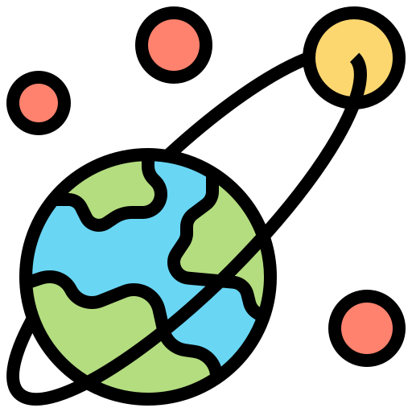
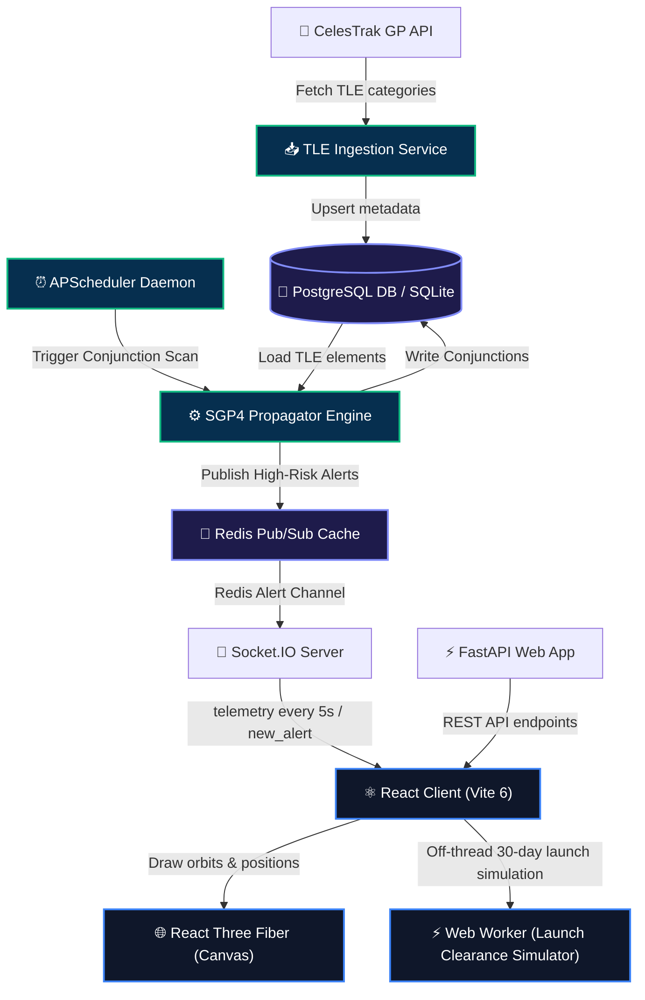

<p align="center">
  
</p>

<h1 align="center">OrbitalWatch 🛰️</h1>

<p align="center">
  <strong>An advanced, real-time Space Situational Awareness (SSA) & Space Traffic Control dashboard that tracks orbiting objects, calculates proximity collision risks (conjunctions), predicts launch trajectory clearances, and visualizes orbital mechanics on an interactive 3D WebGL Earth.</strong>
</p>

<p align="center">
  
  
  
  
  
  
</p>

---

## 📖 Table of Contents

1. [Introduction & Problem Statement](#-introduction--problem-statement)
2. [Key Features](#-key-features)
3. [System Architecture](#-system-architecture)
4. [Physics & Collision Detection Engine (Under the Hood)](#-physics--collision-detection-engine-under-the-hood)
    - [SGP4 Orbital Propagation](#sgp4-orbital-propagation)
    - [Conjunction Analysis Algorithm](#conjunction-analysis-algorithm)
    - [Risk Evaluation & Collision Probability](#risk-evaluation--collision-probability)
    - [Launch Trajectory Clearance & Delta-V Simulation](#launch-trajectory-clearance--delta-v-simulation)
5. [Database Schema](#-database-schema)
6. [WebSocket Interface Specification](#-websocket-interface-specification)
7. [API Route Reference](#-api-route-reference)
8. [Project Structure](#-project-structure)
9. [Local Development Setup](#-local-development-setup)
10. [Testing & Verification](#-testing--verification)
11. [Configuration & Environment Variables](#-configuration--environment-variables)
12. [Production Deployment Guide](#-production-deployment-guide)
13. [Keyboard Shortcuts](#-keyboard-shortcuts)
14. [Performance Optimizations](#-performance-optimizations)

---

## 🌌 Introduction & Problem Statement

Currently, there are over **40,000 tracked artificial objects** orbiting Earth in Low Earth Orbit (LEO), Medium Earth Orbit (MEO), and Geostationary Orbit (GEO). Managing the risks associated with active spacecraft colliding with space debris requires rapid, accessible, and automated tracking. Commercial Space Situational Awareness (SSA) software suites are prohibitively expensive ($10,000 to $100,000+ annually), leaving university space labs, cubesat operators, and debris researchers locked out of space traffic safety.

**OrbitalWatch** democratizes satellite tracking, launch clearance evaluation, and collision risk analysis. It ingests live TLE (Two-Line Element) datasets from Celestrak, propagates coordinates using high-fidelity SGP4 engines, evaluates conjunction risks in real-time, predicts collision probabilities for proposed launch orbits, and streams telemetry directly into a responsive 3D WebGL globe.

---

## 🚀 Key Features

*   **WebGL 3D Earth Visualizer**: Interactive 3D globe rendered with React Three Fiber, OrbitControls, custom atmospheric shaders, and starfield environments.
*   **Instanced WebGL Mesh Rendering**: Renders hundreds of active satellites simultaneously with high GPU frame rates (locked at 60 FPS) using Three.js `InstancedMesh`.
*   **SGP4 Orbital Propagator**: Runs Python-based SGP4 coordinate propagation (calculating geodetic latitude, longitude, altitude, orbital period, inclination, and velocity vector).
*   **Real-Time 5-Second Telemetry Streaming**: Pushes current satellite geodetic coordinates to the React dashboard over Socket.IO every 5 seconds.
*   **Conjunction Warning System**: Scans the satellite catalog for close-approach encounters within a 1.0 km radius over a 72-hour forecast window using multi-tier spatial and temporal filters.
*   **Dynamic Alert Panel & 3D Proximity Visualizer**: Renders active and incoming conjunction events color-coded by severity levels (HIGH, MEDIUM, LOW) with simulated audio-visual warnings, flashing proximity lines, collision midpoints, and intersecting orbital tracks.
*   **Launch Trajectory Clearance Simulator**: Simulates proposed satellite insertion parameters (altitude, inclination, launch site, eccentricity, payload mass) using a dedicated client-side Web Worker SGP4 engine. Forecasts 30-day collision risks using Foster $P_c$ math and suggests alternative collision-free orbits with Hohmann/plane-change Delta-$V$ maneuver estimates.
*   **Automatic Camera Tracking & Search**: Supports instant searching by NORAD ID or satellite name, locking camera focus to follow objects, and displaying historical orbit paths.
*   **Telemetry Refresh & Demo Mode**: Trigger manual background recalculations or activate an automated simulation tour across active satellites and conjunction events.

---

## 🏗️ System Architecture

OrbitalWatch is structured as a decoupled multi-tier architecture: **Data Ingestion & Physics Engine**, **FastAPI REST & Socket.IO Server**, and **React Three Fiber Dashboard with Client Web Workers**.



---

## ⚙️ Physics & Collision Detection Engine (Under the Hood)

### SGP4 Orbital Propagation
The SGP4 model is the standard algorithm used to calculate the positions and velocities of Earth-orbiting satellites relative to the Earth-centered inertial (ECI) coordinate frame. The solver ingests two-line elements (TLE) consisting of inclination, eccentricity, argument of perigee, mean anomaly, and mean motion.

Using Python `skyfield` and `sgp4`:
1. The raw TLE text lines are loaded into `EarthSatellite` models.
2. A timescale object is initialized: `ts = load.timescale()`.
3. The coordinate is evaluated at UTC time $t$: `geocentric = earth_satellite.at(t)`.
4. The geodetic subpoint (latitude, longitude, and elevation/altitude) is extracted:
   $$\text{Subpoint} = \text{geocentric}.\text{subpoint}()$$
5. Geocentric Cartesian coordinates $(X, Y, Z)$ are derived in kilometers:
   $$X, Y, Z = \text{geocentric}.\text{position}.\text{km}$$

To maximize efficiency, parsed `EarthSatellite` object representations are stored in an in-memory cache to prevent repetitive, CPU-heavy string parsing.

---

### Conjunction Analysis Algorithm
Evaluating collision risks for $N$ objects over a time span of 72 hours at a fine granularity is computationally expensive ($O(N^2 \cdot T)$). OrbitalWatch employs a **multi-phase spatial filter**:

```
[All Satellite Models (N <= 500)]
               │
               ▼
┌─────────────────────────────┐
│ 1. Geocentric Shell Filter  │  <-- Ellipsoidal radial shells: [r_min, r_max] overlap within 15 km
└──────────────┬──────────────┘
               │ (Filters out ~90% of non-colliding pairs)
               ▼
┌─────────────────────────────┐
│  2. Coarse Time Step Scan   │  <-- Evaluate distance over 72 hrs at 10-minute intervals
└──────────────┬──────────────┘
               │ (Flags pairs with minimum distance < 1.0 km)
               ▼
┌─────────────────────────────┐
│   3. Time Refinement Loop   │  <-- Zoom into +/- 10 min window with 1-minute steps
└──────────────┬──────────────┘
               │ (Computes precise TCA and Relative Velocity)
               ▼
[Active Conjunction Model Created]
```

1. **Geocentric Shell Filter**:
   For each satellite, perigee ($r_{\text{min}}$) and apogee ($r_{\text{max}}$) distances are calculated using the semi-major axis $a$ and eccentricity $e$:
   $$r_{\text{min}} = a(1-e) \cdot R_E, \quad r_{\text{max}} = a(1+e) \cdot R_E$$
   A pair of satellites is considered a candidate only if their orbital envelopes overlap within a safety margin of $15.0\text{ km}$:
   $$\Delta R_{\text{overlap}} = \max\left(0.0, r_{\text{min}, B} - r_{\text{max}, A}, r_{\text{min}, A} - r_{\text{max}, B}\right) < 15.0\text{ km}$$
2. **Coarse Time Step Scan**:
   Calculates the separation distance in Cartesian coordinate space at $10\text{-minute}$ steps across the next $72\text{ hours}$. If the distance between two satellites falls below $1.0\text{ km}$ at any step, the pair is flagged for refinement.
3. **Time Refinement Loop**:
   Around the identified coarse Time of Closest Approach (TCA), a second pass is executed in the window of $[T_{\text{coarse}} - 10\text{m}, T_{\text{coarse}} + 10\text{m}]$ using a fine-grained $1\text{-minute}$ resolution to capture the exact TCA.

---

### Risk Evaluation & Collision Probability
Once a close approach is refined, the system categorizes risk based on miss distance:
*   **HIGH RISK**: Miss Distance $< 100\text{ meters}$ ($0.1\text{ km}$)
*   **MEDIUM RISK**: Miss Distance $< 500\text{ meters}$ ($0.5\text{ km}$)
*   **LOW RISK**: Miss Distance $< 1.0\text{ km}$

The **collision probability** ($P_c$) is calculated based on a physical hard-body radius ($r_{\text{hb}} = 5\text{ meters}$) combined with the relative velocity ($V_{\text{rel}}$) at TCA:
$$P_c = \min\left(1.0, \left(\frac{r_{\text{hb}}}{\text{Miss Distance}}\right)^2 \cdot \min\left(1.0, \frac{V_{\text{rel}}}{15.0}\right)\right)$$
To ensure stable visual rendering in the UI, minimum probability floors are clamped at $70\%$ (HIGH), $15\%$ (MEDIUM), and $1\%$ (LOW).

---

### Launch Trajectory Clearance & Delta-V Simulation
The Launch Clearance Simulator evaluates proposed orbits (altitude, inclination, launch site latitude, eccentricity, RAAN) against active space objects:
1. **Foster Collision Probability ($P_c$)**: Calculates collision probability incorporating positional variance $\sigma(t)$ derived from catalog TLE age:
   $$P_c = \exp\left(-\frac{d_{\text{miss}}^2}{2\sigma^2}\right) \cdot \left[1 - \exp\left(-\frac{r_{\text{HBR}}^2}{2\sigma^2}\right)\right]$$
2. **Delta-V Orbit Avoidance Maneuver Calculation**:
   - **Hohmann Transfer Altitude Adjustment**:
     $$\Delta V \approx \left| \frac{v_{\text{orbit}} \cdot \Delta H}{2 \cdot (R_E + H)} \right|$$
   - **Plane Change Inclination Adjustment**:
     $$\Delta V = 2 \cdot v_{\text{orbit}} \cdot \sin\left(\frac{\Delta i}{2}\right)$$
   Suggestions are ranked by lowest $\Delta V$ requirement to guide mission planners toward energy-efficient, collision-free orbits.

---

## 💾 Database Schema

OrbitalWatch uses PostgreSQL (or SQLite locally) via Async SQLAlchemy ORM. Alembic manages database migrations.

### `SatelliteModel` (`satellites`)
Represents cataloged space objects tracked by the system.
```sql
CREATE TABLE satellites (
    id SERIAL PRIMARY KEY,
    norad_id VARCHAR UNIQUE NOT NULL,
    name VARCHAR NOT NULL,
    object_type VARCHAR DEFAULT 'unknown', -- 'payload', 'debris', 'rocket body', 'unknown'
    tle_line1 VARCHAR NOT NULL,
    tle_line2 VARCHAR NOT NULL,
    created_at TIMESTAMP DEFAULT CURRENT_TIMESTAMP
);
CREATE INDEX idx_satellites_norad_id ON satellites(norad_id);
```

### `ConjunctionModel` (`conjunctions`)
Represents calculated close-approach events.
```sql
CREATE TABLE conjunctions (
    id SERIAL PRIMARY KEY,
    sat1_norad_id VARCHAR REFERENCES satellites(norad_id) ON DELETE CASCADE,
    sat2_norad_id VARCHAR REFERENCES satellites(norad_id) ON DELETE CASCADE,
    approach_time TIMESTAMP NOT NULL,
    miss_distance_km FLOAT NOT NULL,
    risk_level VARCHAR NOT NULL, -- 'HIGH', 'MEDIUM', 'LOW'
    probability FLOAT NOT NULL,
    relative_velocity FLOAT NOT NULL,
    created_at TIMESTAMP DEFAULT CURRENT_TIMESTAMP
);
CREATE INDEX idx_conjunctions_sat1 ON conjunctions(sat1_norad_id);
CREATE INDEX idx_conjunctions_sat2 ON conjunctions(sat2_norad_id);
```

---

## 🔌 WebSocket Interface Specification

OrbitalWatch uses **Socket.IO** to stream real-time orbital updates. Clients connect and receive automated broadcasts.

### Outgoing Events (Server to Client)

#### `connected`
Sent upon successful WebSocket handshake.
```json
{ "status": "ok" }
```

#### `satellite_positions`
Broadcast every **5 seconds** to update 3D globe coordinates for all cataloged objects.
```json
[
  {
    "norad_id": "25544",
    "name": "ISS (ZARYA)",
    "lat": -12.3456,
    "lon": 45.6789,
    "alt": 421.34,
    "latitude": -12.3456,
    "longitude": 45.6789,
    "altitude_km": 421.34,
    "velocity_kms": 7.66,
    "timestamp": "2026-07-20T11:15:00.000Z",
    "type": "payload",
    "object_type": "payload"
  }
]
```

#### `new_alert`
Emitted immediately when a high-risk conjunction is detected during scheduling sweeps.
```json
{
  "id": 14,
  "sat1_norad_id": "25544",
  "sat1_name": "ISS (ZARYA)",
  "sat1_type": "payload",
  "sat2_norad_id": "49044",
  "sat2_name": "ISS (NAUKA)",
  "sat2_type": "payload",
  "approach_time": "2026-07-21T05:22:10.000Z",
  "miss_distance_km": 0.027,
  "risk_level": "HIGH",
  "probability": 0.732,
  "relative_velocity": 1.85
}
```

---

### Incoming Events (Client to Server)

#### `subscribe_satellites`
Requests tracking updates for specific NORAD IDs. Server acknowledges with `subscription_updated`.
```json
{
  "norad_ids": ["25544", "49044"]
}
```

---

## ⚡ API Route Reference

FastAPI exposes REST API endpoints under `/` and `/api`.

| HTTP Verb | Route | Description | Query Parameters | Response Model / Payload |
| :--- | :--- | :--- | :--- | :--- |
| **GET** | `/ping` | Instant server liveness check (no DB dependency) | None | `{ status: "ok" }` |
| **GET** | `/health` | In-depth database & Redis connectivity status | None | `{ status: string, db: bool, redis: bool, timestamp: string }` |
| **GET** | `/api/stats` | Aggregated catalog stats & conjunction metrics | None | `{ total_satellites: int, debris_count: int, active_conjunctions: int, high_risk_count: int, last_scan: string, last_updated: int }` |
| **GET** | `/api/satellites` | Retrieves paginated list of satellites | `limit` (default=500), `offset` (default=0), `object_type` | `List[SatelliteResponse]` |
| **GET** | `/api/satellites/search` | Search satellites by name or NORAD ID | `q` (string, required), `limit` (default=20) | `List[SatelliteResponse]` |
| **GET** | `/api/satellites/{norad_id}` | Retrieve details for a single NORAD object | None | `SatelliteResponse` |
| **GET** | `/api/propagate/{norad_id}` | Propagate satellite to a target UTC time | `at` (datetime string, optional) | `PositionResponse` |
| **GET** | `/api/conjunctions` | Retrieve computed close-approach alerts | `risk_level`, `hours_ahead` (default=72), `limit` (default=100) | `List[ConjunctionResponse]` |
| **GET** | `/api/conjunctions/{id}` | Retrieve details for a single conjunction | None | `ConjunctionResponse` |
| **DELETE** | `/api/conjunctions/clear` | Purge conjunction alerts older than 24h | None | `{ deleted: int }` |
| **POST** | `/api/refresh` | Trigger immediate background conjunction rescan | None | `{ success: true, message: string, timestamp: string }` |

---

## 📂 Project Structure

```
OrbitalWatch/
├── assets/                 # Project images, logos, and visual assets
├── docs/                   # Documentation (DEPLOYMENT.md, PLAN.md, PRD.md)
├── backend/                # FastAPI Python Server
│   ├── alembic/            # Database migration scripts
│   ├── app/                # Application code
│   │   ├── api/            # API endpoints (satellites, conjunctions, propagate, refresh)
│   │   ├── core/           # Configuration, Logging, Async DB setup
│   │   ├── models/         # SQLAlchemy DB models (Satellite, Conjunction)
│   │   ├── schemas/        # Pydantic serialization schemas
│   │   ├── services/       # Physics, SGP4 propagation, Conjunction scanner, Scheduler
│   │   └── websocket/      # Socket.IO connection manager & position stream loop
│   ├── tests/              # Pytest test suite
│   ├── app.py              # Main ASGI app runner with auto-migrations
│   ├── requirements.txt    # Python packages
│   ├── seed.py             # Celestrak satellite catalog seeder
│   ├── seed_debris.py      # Space debris catalog seeder
│   └── verify_backend.py   # Automated backend integration test script
└── frontend/               # React 19 Vite Dashboard Client
    ├── src/
    │   ├── components/     # Component hierarchy
    │   │   ├── Dashboard/  # AlertPanel, SatelliteInfo, LaunchSimulatorPanel, etc.
    │   │   ├── Globe/      # ThreeGlobe (R3F Canvas), SatelliteTooltip, LoadingSphere
    │   │   └── Layout/     # Header, Sidebar, MainLayout
    │   ├── context/        # React global AppContext provider
    │   ├── hooks/          # Custom hooks (useSatellites, useWebSocket, useKeyboardShortcuts)
    │   ├── services/       # Axios API client & Socket.IO webSocket client
    │   ├── utils/          # Orbital math & SGP4 helpers
    │   └── workers/        # propagation.worker.js (Off-thread Web Worker engine)
    ├── package.json        # Frontend dependencies & scripts
    └── vite.config.js      # Vite project settings & local dev proxy
```

---

## 💻 Local Development Setup

### Prerequisites
*   **Node.js**: v18.0.0+ and `npm`
*   **Python**: v3.10 or v3.11

---

### 1. Backend Setup
1. Navigate to the backend directory:
   ```bash
   cd backend
   ```
2. Create and activate a Python virtual environment:
   *   **Windows**: `python -m venv .venv` && `.venv\Scripts\activate`
   *   **macOS/Linux**: `python3 -m venv .venv` && `source .venv/bin/activate`
3. Install Python dependencies:
   ```bash
   pip install -r requirements.txt
   ```
4. Configure environment file:
   ```bash
   cp .env.example .env
   ```
5. Apply database migrations:
   ```bash
   alembic upgrade head
   ```
6. Ingest initial satellite catalog data:
   ```bash
   python seed.py
   python seed_debris.py
   ```
7. Start the FastAPI development server:
   ```bash
   python app.py
   ```
   *The ASGI server runs at `http://localhost:8000`. Interactive API Docs are available at `http://localhost:8000/docs`.*

---

### 2. Frontend Setup
1. Navigate to the frontend directory:
   ```bash
   cd ../frontend
   ```
2. Install Node packages:
   ```bash
   npm install
   ```
3. Start the Vite development server:
   ```bash
   npm run dev
   ```
4. Access the dashboard in your browser at `http://localhost:5173`.

---

## 🧪 Testing & Verification

For the complete end-to-end testing and execution walkthrough, see **[docs/GUIDE.md](docs/GUIDE.md)**.

*   **Backend Tests (pytest)**:
    ```bash
    cd backend
    pytest
    ```
*   **Backend Verification Checklist**:
    ```bash
    cd backend
    python verify_backend.py
    ```
*   **Frontend Unit Tests (Vitest)**:
    ```bash
    cd frontend
    npm run test
    ```
*   **Frontend Linter Check**:
    ```bash
    cd frontend
    npm run lint
    ```

---

## 📋 Configuration & Environment Variables

### Backend Configuration (`backend/.env`)
| Key | Type | Default | Description |
| :--- | :--- | :--- | :--- |
| `DATABASE_URL` | String | `sqlite+aiosqlite:///./orbitalwatch.db` | Async DB URI (supports SQLite & PostgreSQL) |
| `REDIS_URL` | String | `redis://localhost:6379/0` | Valkey / Redis instance connection URI |
| `CORS_ORIGINS` | JSON List | `["http://localhost:5173"]` | Authorized origin list for CORS |
| `TLE_UPDATE_INTERVAL_HOURS` | Integer | `24` | Refresh frequency for Celestrak orbital data |
| `HOST` | String | `0.0.0.0` | Bind host IP address |
| `PORT` | Integer | `8000` | Server port |

### Frontend Configuration (`frontend/.env.development` / `.env.production`)
| Key | Type | Default | Description |
| :--- | :--- | :--- | :--- |
| `VITE_API_URL` | String | `http://localhost:8000/api` | REST API base endpoint URL |
| `VITE_WS_URL` | String | `http://localhost:8000` | Socket.IO target server URL |

---

## 🌐 Production Deployment Guide

### Backend (Render)
1. Create a **Web Service** connected to your repository on Render.
2. Set Environment to `Python 3`.
3. Set **Root Directory** to `backend`.
4. Set Build Command to `pip install -r requirements.txt` and Start Command to `python app.py`.
5. Add environment variables (`DATABASE_URL` for PostgreSQL and `REDIS_URL` for Valkey/Redis).

### Frontend (Vercel)
1. Connect repository on Vercel and set **Root Directory** to `frontend`.
2. Select `Vite` framework template.
3. Configure `VITE_API_URL` and `VITE_WS_URL` targeting your live backend.
4. Deploy. `vercel.json` rewrite rules will route client-side navigation seamlessly to `index.html`.

---

## ⌨️ Keyboard Shortcuts

| Shortcut Key | Action |
| :---: | :--- |
| <kbd>/</kbd> | Focus dashboard search bar |
| <kbd>g</kbd> | Switch view to 3D Earth Globe |
| <kbd>a</kbd> | Switch view to Conjunction Alerts table |
| <kbd>f</kbd> | Lock / unlock camera tracking on selected satellite |
| <kbd>d</kbd> | Toggle automated Demo Mode simulation |
| <kbd>?</kbd> | Open keyboard shortcuts modal overlay |
| <kbd>Esc</kbd> | Close active panels, cards, or menus |

---

## 🚀 Performance Optimizations

*   **Instanced WebGL Point Cloud**: Three.js `InstancedMesh` renders hundreds of space objects in a single draw call within `ThreeGlobe.jsx`, achieving locked **60 FPS** WebGL performance.
*   **Web Worker Off-Thread Execution**: Runs 30-day SGP4 launch trajectory clearance calculations inside a dedicated Web Worker (`propagation.worker.js`), ensuring zero UI frame stutter during heavy computation.
*   **SGP4 Object Caching**: Caches compiled `EarthSatellite` binary objects in memory, increasing propagation speed by **500% to 1000%**.
*   **N+1 Query Elimination**: Fetches satellite metadata in bulk using single `IN (...)` queries in FastAPI, reducing serialization database overhead from $O(N)$ to $O(1)$.
