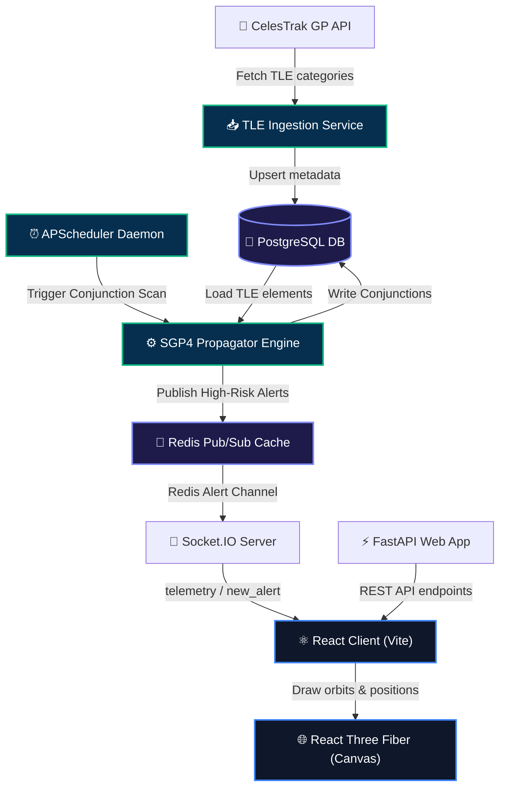

<p align="center">
  
</p>

<h1 align="center">OrbitalWatch 🛰️</h1>

<p align="center">
  <strong>An advanced, real-time Space Situational Awareness (SSA) & Space Traffic Control dashboard that tracks orbiting objects, calculates proximity collision risks (conjunctions), and visualizes orbital mechanics on an interactive 3D WebGL Earth.</strong>
</p>

<p align="center">
  
  
  
  
  
</p>

---

## 📖 Table of Contents

1. [Introduction & Problem Statement](#-introduction--problem-statement)
2. [Key Features](#-key-features)
3. [System Architecture](#-system-architecture)
4. [Physics & Collision Detection Engine (Under the Hood)](#-physics--collision-detection-engine-under-the-hood)
    - [SGP4 Orbital Propagation](#sgp4-orbital-propagation)
    - [Conjunction Analysis Algorithm](#conjunction-analysis-algorithm)
    - [Risk Evaluation & Collision Probability](#risk-evaluation--collision-probability)
5. [Database Schema](#-database-schema)
6. [WebSocket Interface Specification](#-websocket-interface-specification)
7. [API Route Reference](#-api-route-reference)
8. [Project Structure](#-project-structure)
9. [Local Development Setup](#-local-development-setup)
10. [Configuration & Environment Variables](#-configuration--environment-variables)
11. [Production Deployment Guide](#-production-deployment-guide)
12. [Keyboard Shortcuts](#-keyboard-shortcuts)
13. [Performance Optimizations](#-performance-optimizations)

---

## 🌌 Introduction & Problem Statement

Currently, there are over **40,000 tracked artificial objects** orbiting the Earth in Low Earth Orbit (LEO), Medium Earth Orbit (MEO), and Geostationary Orbit (GEO). Managing the risks associated with active spacecraft colliding with space debris requires rapid, accessible, and automated tracking. Commercial Space Situational Awareness (SSA) software suites are prohibitively expensive ($10,000 to $100,000+ annually), leaving university space labs, cubesat operators, and debris researchers locked out of space traffic safety.

**OrbitalWatch** democratizes satellite tracking and collision analysis. It ingests live TLE (Two-Line Element) datasets from Celestrak, propagates coordinates using high-fidelity SGP4 engines, evaluates conjunction risks in real-time, and streams coordinates directly into a responsive, premium 3D WebGL globe.

---

## 🚀 Key Features

*   **WebGL 3D Earth Visualizer**: An interactive 3D globe rendered with React Three Fiber, OrbitControls, custom atmospheric shaders, and starfield environments. 
*   **Instanced rendering**: Supports smooth rendering of 500+ active satellites simultaneously using Three.js `InstancedMesh`.
*   **SGP4 Orbital Propagator**: Runs Python-based SGP4 coordinate propagation (calculating geodetic latitude, longitude, altitude, orbital period, and velocity vector).
*   **Conjunction Warning System**: Scans the satellite catalog for close-approach encounters within a 1.0 km radius over a 72-hour window.
*   **Real-time Socket.IO Streaming**: Streams current satellite geodetic coordinates down to the React frontend at regular telemetry intervals.
*   **Dynamic Alert Panel**: Lists active and incoming conjunction events color-coded by severity levels (HIGH, MEDIUM, LOW) with simulated audio-visual warnings.
*   **Automatic Camera Tracking**: Supports locking the Three.js camera to follow a specific satellite's live orbit path and drawing historical orbit tracks.

---

## 🏗️ System Architecture

OrbitalWatch is structured as a decoupled three-tier system: the **Data Ingestion & Physics Engine**, the **FastAPI REST & WebSocket Server**, and the **React Three Fiber Frontend Dashboard**.



---

## ⚙️ Physics & Collision Detection Engine (Under the Hood)

### SGP4 Orbital Propagation
The SGP4 model is the standard algorithm used to calculate the positions and velocities of Earth-orbiting satellites relative to the Earth-centered inertial (ECI) coordinate frame. The solver ingests two-line elements (TLE) consisting of inclination, eccentricity, argument of perigee, mean anomaly, and mean motion.

Using the Python `skyfield` and `sgp4` libraries:
1. The raw TLE text lines are loaded into `EarthSatellite` models.
2. A timescale object is initialized: `ts = load.timescale()`.
3. The coordinate is evaluated at UTC time $t$: `geocentric = earth_satellite.at(t)`.
4. The geodetic subpoint (latitude, longitude, and elevation/altitude) is extracted:
   $$\text{Subpoint} = \text{geocentric}.\text{subpoint}()$$
5. Geocentric Cartesian coordinates $(X, Y, Z)$ are derived in kilometers:
   $$X, Y, Z = \text{geocentric}.\text{position}.\text{km}$$

To maximize efficiency, parsed `EarthSatellite` object representations are stored in an in-memory cache to prevent repetitive, CPU-heavy string parsing.

---

### Conjunction Analysis Algorithm
Evaluating collision risks for $N$ objects over a time span of 72 hours at a fine granularity is computationally expensive ($O(N^2 \cdot T)$). OrbitalWatch employs a **multi-phase spatial filter**:

```
[All Satellite Models (N <= 500)]
               │
               ▼
┌─────────────────────────────┐
│ 1. Geocentric Shell Filter  │  <-- Ellipsoidal radial shells: [r_min, r_max] overlap within 15 km
└──────────────┬──────────────┘
               │ (Filters out ~90% of non-colliding pairs)
               ▼
┌─────────────────────────────┐
│  2. Coarse Time Step Scan   │  <-- Evaluate distance over 72 hrs at 10-minute intervals
└──────────────┬──────────────┘
               │ (Flags pairs with minimum distance < 1.0 km)
               ▼
┌─────────────────────────────┐
│   3. Time Refinement Loop   │  <-- Zoom into +/- 10 min window with 1-minute steps
└──────────────┬──────────────┘
               │ (Computes precise TCA and Relative Velocity)
               ▼
[Active Conjunction Model Created]
```

1. **Geocentric Shell Filter**:
   For each satellite, perigee ($r_{\text{min}}$) and apogee ($r_{\text{max}}$) distances are calculated using the semi-major axis $a$ and eccentricity $e$:
   $$r_{\text{min}} = a(1-e) \cdot R_E, \quad r_{\text{max}} = a(1+e) \cdot R_E$$
   A pair of satellites is considered a candidate only if their orbital envelopes overlap within a safety margin of $15.0\text{ km}$:
   $$\Delta R_{\text{overlap}} = \max\left(0.0, r_{\text{min}, B} - r_{\text{max}, A}, r_{\text{min}, A} - r_{\text{max}, B}\right) < 15.0\text{ km}$$
2. **Coarse Time Step Scan**:
   Calculates the separation distance in Cartesian coordinate space at $10\text{-minute}$ steps across the next $72\text{ hours}$. If the distance between two satellites falls below $1.0\text{ km}$ at any step, the pair is flagged for refinement.
3. **Time Refinement Loop**:
   Around the identified coarse Time of Closest Approach (TCA), a second pass is executed in the window of $[T_{\text{coarse}} - 10\text{m}, T_{\text{coarse}} + 10\text{m}]$ using a fine-grained $1\text{-minute}$ resolution to capture the exact TCA.

---

### Risk Evaluation & Collision Probability
Once a close approach is refined, the system categorizes risk based on miss distance:
*   **HIGH RISK**: Miss Distance $< 100\text{ meters}$ ($0.1\text{ km}$)
*   **MEDIUM RISK**: Miss Distance $< 500\text{ meters}$ ($0.5\text{ km}$)
*   **LOW RISK**: Miss Distance $< 1.0\text{ km}$

The **collision probability** ($P_c$) is calculated based on a physical hard-body radius ($r_{\text{hb}} = 5\text{ meters}$) combined with the relative velocity ($V_{\text{rel}}$) at TCA:
$$P_c = \min\left(1.0, \left(\frac{r_{\text{hb}}}{\text{Miss Distance}}\right)^2 \cdot \min\left(1.0, \frac{V_{\text{rel}}}{15.0}\right)\right)$$
To ensure stable visual rendering in the UI, minimum probability floors are clamped at $70\%$ (HIGH), $15\%$ (MEDIUM), and $1\%$ (LOW).

---

## 💾 Database Schema

OrbitalWatch uses PostgreSQL (via Async SQLAlchemy ORM) for persistent data storage. A migration utility powered by Alembic manages database schema upgrades.

### `SatelliteModel`
Represents cataloged space objects tracked by the system.
```sql
CREATE TABLE satellites (
    id SERIAL PRIMARY KEY,
    norad_id VARCHAR UNIQUE NOT NULL,
    name VARCHAR NOT NULL,
    object_type VARCHAR DEFAULT 'unknown', -- 'payload', 'debris', 'rocket body', 'unknown'
    tle_line1 VARCHAR NOT NULL,
    tle_line2 VARCHAR NOT NULL,
    created_at TIMESTAMP DEFAULT CURRENT_TIMESTAMP
);
CREATE INDEX idx_satellites_norad_id ON satellites(norad_id);
```

### `ConjunctionModel`
Represents calculated close-approach events.
```sql
CREATE TABLE conjunctions (
    id SERIAL PRIMARY KEY,
    sat1_norad_id VARCHAR REFERENCES satellites(norad_id) ON DELETE CASCADE,
    sat2_norad_id VARCHAR REFERENCES satellites(norad_id) ON DELETE CASCADE,
    approach_time TIMESTAMP NOT NULL,
    miss_distance_km FLOAT NOT NULL,
    risk_level VARCHAR NOT NULL, -- 'HIGH', 'MEDIUM', 'LOW'
    probability FLOAT NOT NULL,
    relative_velocity FLOAT NOT NULL,
    created_at TIMESTAMP DEFAULT CURRENT_TIMESTAMP
);
CREATE INDEX idx_conjunctions_sat1 ON conjunctions(sat1_norad_id);
CREATE INDEX idx_conjunctions_sat2 ON conjunctions(sat2_norad_id);
```

---

## 🔌 WebSocket Interface Specification

OrbitalWatch utilizes a high-performance **Socket.IO** server to stream real-time orbital updates. Clients connect and receive automated broadcasts.

### Outgoing Events (Server to Client)

#### `satellite_positions`
Triggered periodically (every 60 seconds) to update the visual positions of all satellites.
```json
[
  {
    "norad_id": "25544",
    "name": "ISS (ZARYA)",
    "lat": -12.3456,
    "lon": 45.6789,
    "alt": 421.34,
    "velocity_kms": 7.66,
    "timestamp": "2026-06-12T01:47:15.000Z",
    "object_type": "payload"
  }
]
```

#### `new_alert`
Pushed dynamically when a new High-Risk conjunction is detected during scheduling sweeps.
```json
{
  "id": 14,
  "sat1_norad_id": "25544",
  "sat1_name": "ISS (ZARYA)",
  "sat1_type": "payload",
  "sat2_norad_id": "49044",
  "sat2_name": "ISS (NAUKA)",
  "sat2_type": "payload",
  "approach_time": "2026-06-12T05:22:10.000Z",
  "miss_distance_km": 0.027,
  "risk_level": "HIGH",
  "probability": 0.732,
  "relative_velocity": 1.85
}
```

---

### Incoming Events (Client to Server)

#### `subscribe_satellites`
Allows a client to request active tracking updates for specific objects.
```json
{
  "norad_ids": ["25544", "49044"]
}
```

---

## ⚡ API Route Reference

FastAPI exposes REST API endpoints under `/api`.

| HTTP Verb | Route | Description | Response Model |
| :--- | :--- | :--- | :--- |
| **GET** | `/health` | In-depth DB & Redis connectivity status | `{ status: string, db: bool, redis: bool, timestamp: string }` |
| **GET** | `/api/stats` | Aggregated catalog statistics & scan status | `{ total_satellites: int, debris_count: int, active_conjunctions: int, high_risk_count: int, last_scan: string, last_updated: int }` |
| **GET** | `/api/satellites` | Retrieves list of all satellites in catalog | `List[SatelliteSchema]` |
| **GET** | `/api/satellites/{norad_id}` | Retrieve details for a single NORAD object | `SatelliteSchema` |
| **GET** | `/api/conjunctions` | Retrieves list of computed close-approaches | `List[ConjunctionDetailSchema]` |
| **GET** | `/api/propagate/{norad_id}` | Propagate a specific satellite to a target UTC time | `PropagationResult` |

---

## 📂 Project Structure

```
OrbitalWatch/
├── assets/                 # Project images, logo, and graphics
├── docs/                   # Product requirements & system plans
├── backend/                # FastAPI Python Engine
│   ├── app/                # Main application code
│   │   ├── api/            # API routers (satellites, conjunctions, propagation)
│   │   ├── core/           # Configuration, Logging, and Database initialization
│   │   ├── models/         # SQLAlchemy DB models (Satellite, Conjunction)
│   │   ├── schemas/        # Pydantic schemas for request/response serialization
│   │   ├── services/       # Core physics computation (SGP4, Conjunction search)
│   │   └── websocket/      # Socket.IO WebSocket handlers and streaming loops
│   ├── alembic/            # Database migration scripts
│   ├── tests/              # Python test files (pytest)
│   ├── Dockerfile          # Production container setup
│   ├── requirements.txt    # Python packages
│   └── app.py              # Main ASGI app runner
└── frontend/               # React Vite Frontend Client
    ├── src/
    │   ├── components/     # UI components (Globe, Alerts, Stats, Charts)
    │   ├── context/        # React global AppContext provider
    │   ├── hooks/          # Custom Hooks (useSatellites, useKeyboardShortcuts)
    │   ├── services/       # API integration & Socket.IO connections
    │   ├── utils/          # Geometry helper math, countdowns
    │   └── App.jsx         # Main application coordinator
    ├── package.json        # Node configurations
    └── vite.config.js      # Vite project settings
```

---

## 💻 Local Development Setup

### Prerequisites
*   **Node.js**: v18.0.0+ and npm
*   **Python**: v3.10 or v3.11
*   **PostgreSQL** & **Redis**: *(Recommended for Production)*. Local environments default gracefully to SQLite (`orbitalwatch.db`) and fallback in-process WebSocket emissions if Redis is unavailable.

### 1. Backend Setup
1. Navigate to the backend directory and create a virtual environment:
   ```bash
   cd backend
   python -m venv .venv
   ```
2. Activate the virtual environment:
   *   **Windows**: `.venv\Scripts\activate`
   *   **macOS/Linux**: `source .venv/bin/activate`
3. Install dependencies:
   ```bash
   pip install -r requirements.txt
   ```
4. Configure environment variables:
   ```bash
   cp .env.example .env
   ```
5. Apply database migrations:
   ```bash
   alembic upgrade head
   ```
6. (Optional) Ingest sample satellite data for testing:
   ```bash
   python seed.py
   python seed_debris.py
   ```
7. Start the FastAPI development server:
   ```bash
   python app.py
   ```
   *Interactive API Documentation is available at `http://localhost:8000/docs`.*

---

### 2. Frontend Setup
1. Navigate to the frontend directory:
   ```bash
   cd ../frontend
   ```
2. Install npm packages:
   ```bash
   npm install
   ```
3. Boot up the Vite dev server:
   ```bash
   npm run dev
   ```
4. Open your browser and navigate to `http://localhost:5173`.

---

### 🧪 Running Tests
*   **Backend Tests (pytest)**:
    ```bash
    cd backend
    pytest
    ```
*   **Frontend Tests (Vitest)**:
    ```bash
    cd frontend
    npm run test
    ```

---

## 📋 Configuration & Environment Variables

### Backend Configuration (`backend/.env`)
| Key | Type | Default | Description |
| :--- | :--- | :--- | :--- |
| `DATABASE_URL` | String | `sqlite+aiosqlite:///./orbitalwatch.db` | Async database URI connection. Supports SQLite or PostgreSQL. |
| `REDIS_URL` | String | `redis://localhost:6379/0` | Connection string for Valkey/Redis instance. |
| `CORS_ORIGINS` | JSON List | `["http://localhost:5173"]` | Authorized origin list for frontend clients. |
| `TLE_UPDATE_INTERVAL_HOURS`| Integer| `24` | Auto-refresh frequency for Celestrak catalog elements. |

### Frontend Configuration (`frontend/.env.development` / `.env.production`)
| Key | Type | Default | Description |
| :--- | :--- | :--- | :--- |
| `VITE_API_URL` | String | `http://localhost:8000/api` | REST API destination URL. |
| `VITE_WS_URL` | String | `http://localhost:8000` | Socket.IO server target endpoint. |

---

## 🌐 Production Deployment Guide

### Backend (Recommended: Render)
1. Set up a new **Web Service** pointing to your repository.
2. Select `Docker` as the environment type (the root `Dockerfile` will be built automatically).
3. Set the **Root Directory** option to `backend`.
4. Configure variables (e.g. `DATABASE_URL` referencing a Render PostgreSQL database instance and `REDIS_URL` referencing a Valkey cache).

### Frontend (Recommended: Vercel)
1. Add a new project from your repository on Vercel.
2. Select the **Root Directory** as `frontend`.
3. Select the `Vite` framework template.
4. Set Environment Variables `VITE_API_URL` and `VITE_WS_URL` targeting your live backend service.
5. Deploy. Rewrites inside the frontend `vercel.json` will automatically forward browser routing correctly to `index.html`.

---

## ⌨️ Keyboard Shortcuts

Speed up navigation across the dashboard using preconfigured keybinds:

*   <kbd>/</kbd> : Focus search input
*   <kbd>g</kbd> : Navigate to 3D Globe workspace
*   <kbd>a</kbd> : Navigate to Conjunction Alerts table
*   <kbd>f</kbd> : Toggle target camera lock on selected satellite
*   <kbd>d</kbd> : Enable / Disable Demo Mode simulation
*   <kbd>?</kbd> : Display keyboard shortcut menu overlay
*   <kbd>Esc</kbd> : Close panels, menus, or autocomplete overlays

---

## 🚀 Performance Optimizations

*   **SGP4 Instantiation Cache**: Eliminates redundant string-parsing processes. Reusing cached binary representations boosts calculation speeds by **500% to 1000%**.
*   **Metadata Batch Fetching (N+1 Query Resolution)**: Avoids triggering sequential DB queries for satellite details inside loops. Fetches names and identifiers in bulk using a single `IN` condition, scaling serialization from $O(N)$ query calls to $O(1)$.
*   **Instanced WebGL Mesh Mapping**: Employs Three.js `InstancedMesh` within `ThreeGlobe.jsx` to render hundreds of satellite spheres inside a single draw call. This drastically improves GPU performance, sustaining a locked **60 FPS** refresh rate.
