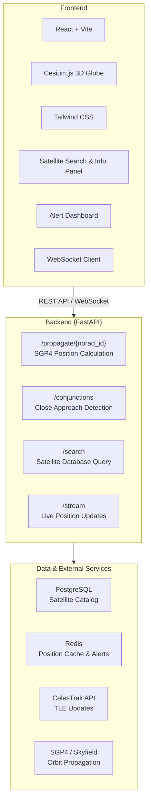

# OrbitalWatch

1\. The Demand (Why This Exists)
--------------------------------

### The Problem

There are **~40,000 tracked objects** orbiting Earth. Space debris travels at 28,000 km/h. A single collision generates thousands of new fragments (Kessler Syndrome). Satellite operators, space agencies, and launch providers currently rely on **manual, delayed, and expensive** conjunction data from sources like Space-Track.org, often with hours of latency.**Real-world pain points:**

*   **Satellite operators** lose sleep over potential collisions but lack affordable, real-time monitoring tools.
    
*   **University CubeSat teams** have zero access to professional SSA (Space Situational Awareness) software.
    
*   **Launch providers** need rapid "go/no-go" collision risk assessments before launch windows.
    

### Who Needs This (Your Users)

**TableUserTheir NeedHow OrbitalWatch HelpsSmall Satellite Operators**"Will my satellite hit debris in the next 72 hours?"Real-time conjunction alerts + probability scores**University Space Labs**"We can't afford AGI/Analytical Graphics software."Free, open-source 3D orbital tracker**Space Debris Researchers**"Visualize debris density by altitude."3D heatmaps + altitude-band analytics**Launch Teams**"Is my launch trajectory clear?"Launch window collision screening

### The Market Gap

Professional SSA tools (AGI STK, COMSPOC) cost **$10,000–$100,000+/year**. There is no **modern, open-source, web-based** tool with real-time 3D visualization for small teams. You are building the "Space Dashboard for everyone else."

2\. What You Must Build (The MVP Feature List)
----------------------------------------------

Your MVP must prove you can **track, predict, and alert** — all in a web browser. Here is the exact feature checklist:

### Core Feature 1: Real-Time Orbital Propagation Engine

*   **Input:** Two-Line Element (TLE) sets from CelesTrak/Space-Track API.
    
*   **Process:** Use SGP4 propagator to calculate real-time position (latitude, longitude, altitude) for any satellite.
    
*   **Output:** Live position updates every 60 seconds.
    

### Core Feature 2: 3D Orbital Visualization

*   **Globe:** Interactive 3D Earth using Cesium.js or Three.js.
    
*   **Objects:** Render satellites as clickable dots with orbital trails (last 90 minutes of path).
    
*   **Debris Layer:** Toggle to show only debris objects (category filtering).
    
*   **Camera:** User can rotate, zoom, and "lock camera" to follow a specific satellite.
    

### Core Feature 3: Conjunction Detection & Collision Prediction

*   **Algorithm:** Calculate distance between all object pairs. Flag any approach within **<<5 km** in the next 72 hours.
    
*   **Probability:** Basic collision probability estimation (using combined hard-body radius + relative velocity).
    
*   **Risk Score:** Low (<1 km), Medium (<500m), High (<100m) — color-coded.
    

### Core Feature 4: Alert Dashboard

*   **Active Alerts Table:** List of upcoming conjunctions with satellite names, approach time, miss distance, and risk level.
    
*   **Detail View:** Click an alert → see both objects' orbits, relative approach animation, and closest approach timestamp.
    
*   **Notification Simulation:** Show how an email/WebSocket alert would fire (simulate the notification UI).
    

### Core Feature 5: Satellite Search & Details

*   **Search:** Search by satellite name (e.g., "ISS," "Starlink-1234," "Hubble").
    
*   **Info Panel:** NORAD ID, altitude, velocity, orbital period, object type (payload, debris, rocket body).
    

3\. What You Must Show in the Demo Video (2–4 Minutes)
------------------------------------------------------

Your video must tell a story. Here is the exact script structure:**TableTimestampSceneWhat to Show0:00–0:30The Problem**Show news headlines about space debris collisions. Show a cluttered 2D table from Space-Track (ugly, static). Say: "This is how we track 40,000 objects."**0:30–0:50The Solution**Transition to your 3D globe. Zoom out to show hundreds of dots orbiting Earth. Say: "This is OrbitalWatch."**0:50–1:40Feature DemoSearch "ISS"** → camera locks to ISS → show live telemetry. **Toggle debris layer** → show clutter in LEO. **Open Alerts Panel** → show a simulated "HIGH RISK" conjunction. Click it → show both objects approaching in 3D with miss distance.**1:40–2:10Technical Depth**Briefly show your code: Python SGP4 propagator, FastAPI endpoint, React frontend. Show architecture diagram. Mention: "We process real TLE data in real-time."**2:10–2:30Impact & Future**"This democratizes SSA for universities and small satellite operators. Future: ML-based anomaly detection and autonomous collision avoidance recommendations."**Critical Rule:** Every screen you show must be **real, working code**. No mockups. No Figma screenshots. The 3D globe must rotate live. The ISS must be at its actual current position.

## 4. Technical Architecture

### Frontend
- **React + Vite** for a fast and responsive user interface.
- **Cesium.js** for interactive 3D Earth and satellite visualization.
- **Tailwind CSS** for modern and responsive styling.
- Satellite search and information dashboard.
- Real-time collision risk alerts with color-coded severity.
- WebSocket integration for live satellite tracking.

### Backend (FastAPI)
- **`/propagate/{norad_id}`** – Computes satellite positions using the SGP4 propagation model.
- **`/conjunctions`** – Detects potential close approaches between satellites.
- **`/search`** – Retrieves satellite information from the catalog.
- **`/stream`** – Provides live satellite position updates through WebSockets.

### Data & External Services
- **PostgreSQL** stores satellite metadata, NORAD IDs, and TLE data.
- **Redis** caches live positions and active conjunction alerts.
- **CelesTrak API** supplies updated TLE datasets.
- **SGP4 / Skyfield** performs orbital propagation and trajectory calculations.

### Key Libraries You Will Use

**TableLayerLibraryPurpose**Propagationskyfield or sgp4SGP4 orbital mechanics3D Globecesium (via resium for React) or three.jsEarth + satellite renderingBackendFastAPIHigh-performance Python APIDatabasePostgreSQL + SQLAlchemySatellite catalog storageCacheRedisLive position caching + pub/subFrontendReact, Tailwind, RechartsUI, dashboard, charts

5\. Data Sources (Free & Legal)
-------------------------------

You need **real data** to prove this is not a toy. Use these free sources:**TableSourceWhat It ProvidesURLCelesTrak**TLE data for all active satellites + debrishttps://celestrak.org/NORAD/elements/**Space-Track.org**Official USSF data (requires free account)https://www.space-track.org**N2YO API**Real-time satellite position (rate-limited free tier)https://www.n2yo.com/api/**For the hackathon:** Pre-download TLE files for ~500 popular objects (ISS, Hubble, Starlinks, debris) and store them in your database. Your backend will propagate from these baseline TLEs in real-time.

6\. Judging Criteria Mapping (How You Score Max Points)
-------------------------------------------------------

**TableCriteriaHow OrbitalWatch DeliversInnovation & Technical Depth**SGP4 orbital mechanics, 3D geospatial visualization, proximity algorithms, real-time WebSocket streaming. This is not a CRUD app.**Engineering Quality**Clean separation: propagator service → API layer → frontend. Dockerized. README with setup. Commit history showing iterative build.**Real-World Impact**Solves a genuine problem for satellite operators, CubeSat teams, and space agencies. Cite real debris incidents (Iridium-Cosmos 2009 collision).**Scalability**Explain: "Current MVP handles 500 objects. With Redis + horizontal scaling, this architecture supports 40,000+ objects via batch propagation workers."**Design & UX**A 3D interactive globe is inherently impressive. Clean dashboard with risk colors (red/yellow/green). No cluttered text.**Execution & Completeness**Working search, working propagation, working alerts, working 3D visualization. All integrated.

7\. The Exact 7-Day Build Sprint
--------------------------------

**TableDayTaskOutputDay 1 (June 8)**Set up FastAPI + PostgreSQL. Download TLE data for 500 objects. Build database schema.API returns satellite list.**Day 2 (June 9)**Build SGP4 propagation endpoint. /propagate/{id} returns live lat/lon/alt/velocity.Backend core logic done.**Day 3 (June 10)**Build conjunction scanner. Python script calculates all pairwise distances in next 72h. Store alerts in Redis.Alert API working.**Day 4 (June 11)**React frontend + Cesium.js setup. Render Earth. Plot satellites as points.3D globe with dots.**Day 5 (June 12)**Search bar, satellite info panel, alert dashboard. WebSocket for live position updates.Full UI + real-time updates.**Day 6 (June 13)**Polish UI, add orbital trails, risk color coding, mobile responsiveness. Write README + docs.Production-ready repo.**Day 7 (June 14)**Record demo video (follow script above). Submit GitHub + video.Submission complete.

8\. What NOT to Build (Scope Killers)
-------------------------------------

❌ **Do not** build a full ML model for collision prediction. SGP4 + distance thresholds are enough for MVP.❌ **Do not** try to render all 40,000 objects. Start with 200–500. Judges understand MVP scope.❌ **Do not** build user authentication/login. It adds zero value to the core demo.❌ **Do not** use mock data. Use real TLEs. Real satellite names. Real positions.**Bottom line:** You are building a **"Space Traffic Control Dashboard"** — a 3D web app that takes real satellite data, runs orbital physics in Python, and presents it in a way that looks like it belongs at NASA or ISRO. That is your demand. That is what you show.**Ready?** Tell me your team's skill split (who knows Python, who knows React, etc.) and I will assign exact Day 1 tasks to each person.

## Production Deployment Instructions

### Backend (Render Deployment)
1. Deploy as a **Web Service** using the `Dockerfile` located in the `backend/` directory.
2. In Render environment settings, configure the following variables:
   - `DATABASE_URL`: Set this to your PostgreSQL connection string (Render's default starting with `postgres://` or `postgresql://` is automatically parsed and mapped to the required `postgresql+asyncpg://` at runtime).
   - `REDIS_URL`: If you have a Redis instance, set its URL here (e.g. `redis://...`). If not, the server dynamically falls back to direct Socket.IO WebSocket alerts.
   - `CORS_ORIGINS`: Set to a JSON array list of allowed origins, e.g., `["https://your-frontend.vercel.app"]` or `["*"]` to allow all.
   - `RELOAD`: Ensure this is omitted or set to `false`.
3. Render automatically provisions the `PORT` variable; the app binds to it on startup.

### Frontend (Vercel Deployment)
1. Deploy the `frontend/` directory to Vercel.
2. In Vercel Environment Variables, configure:
   - `VITE_API_URL`: Set to `https://<your-backend-render-app>.onrender.com/api`
   - `VITE_WS_URL`: Set to `https://<your-backend-render-app>.onrender.com`
3. Since WebSockets require direct persistent connections, the frontend connects directly to Render via `VITE_WS_URL` to receive real-time streams.

