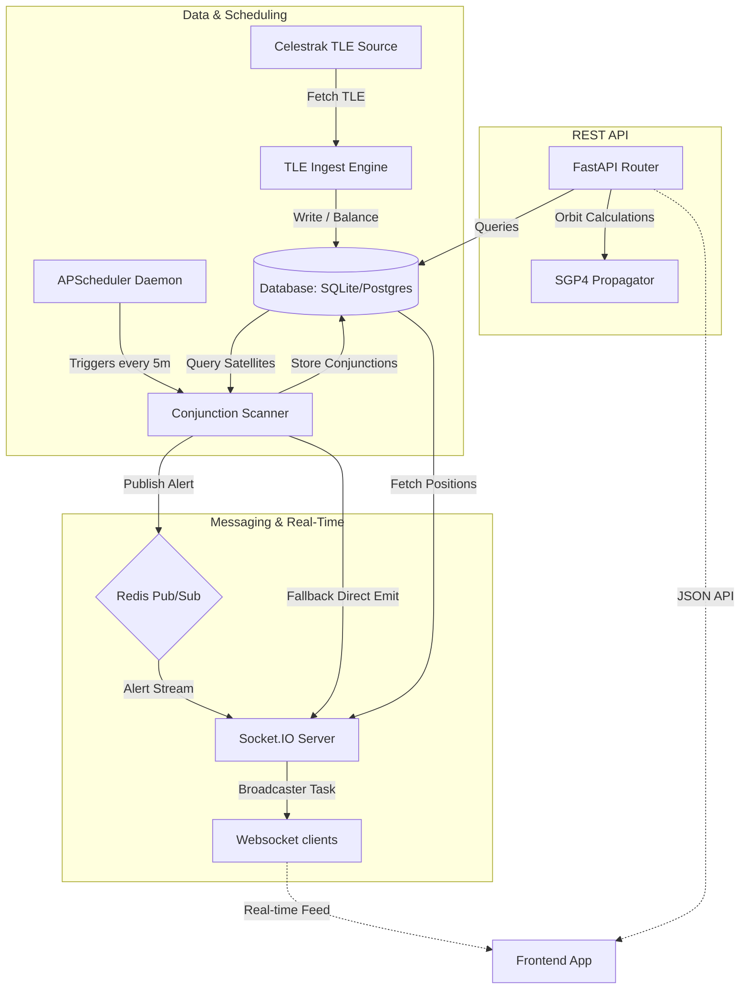

# 🛰️ OrbitalWatch Backend

FastAPI backend for satellite catalog ingestion, SGP4 orbital propagation, conjunction risk assessments, and real-time live position streaming.

---

## 🏗️ System Architecture



### Key Subsystems
*   **TLE Ingestion & Balancing Engine ([app/services/tle_ingest.py](app/services/tle_ingest.py))**: Automatically pulls orbital elements (TLEs) from Celestrak. If the network is unreachable, it generates synthetically valid TLE arrays with high-variance orbital properties to ensure development environment consistency.
*   **Orbit Propagator ([app/services/propagation.py](app/services/propagation.py))**: Leverages `skyfield` and `sgp4` libraries to resolve coordinates (Latitude, Longitude, Altitude), velocities, and orbital period profiles at any custom time vector.
*   **Conjunction Analyzer ([app/services/conjunction.py](app/services/conjunction.py))**: Computes upcoming proximity events (miss distance, collision probability, relative velocity, threat level) across the active catalog.
*   **Real-time Streaming Hub ([app/websocket/stream.py](app/websocket/stream.py))**: Streams active coordinates of up to 500 satellites/debris objects every 60 seconds using asynchronous `python-socketio`. Connects to Redis to listen for high-risk proximity alert events and pushes them to connected clients instantly.

---

## 🛠️ Tech Stack & Dependencies

- **Web Server**: [FastAPI](https://fastapi.tiangolo.com/) + [Uvicorn](https://www.uvicorn.org/) (ASGI standard)
- **Database & ORM**: [SQLAlchemy 2.0](https://www.sqlalchemy.org/) (Asyncio) + [Alembic](https://alembic.sqlalchemy.org/)
- **Orbit Calculation**: [Skyfield](https://rhodesmill.org/skyfield/) + SGP4
- **Real-Time Layer**: [python-socketio](https://python-socketio.readthedocs.io/)
- **Distributed Cache / Broker**: [Redis](https://redis.io/)
- **Scheduling**: [APScheduler](https://apscheduler.readthedocs.io/)
- **Testing**: [pytest](https://docs.pytest.org/) + [pytest-asyncio](https://github.com/pytest-dev/pytest-asyncio)

---

## ⚙️ Setup & Local Development

### 1. Configure Environment Variables
Copy the template `.env.example` and customize settings:
```bash
cp .env.example .env
```
Default parameters are configured for local development using **SQLite** (`orbitalwatch.db`) and local **Redis** server.

### 2. Install Dependencies
Initialize your virtual environment and install packages:
```bash
pip install -r requirements.txt
```

### 3. Run Database Migrations
Generate database tables by executing Alembic migrations:
```bash
alembic upgrade head
```

### 4. Seed Database
Ingest satellite and space debris data from Celestrak (or synthetic fallbacks if Celestrak is down):
```bash
# Seed standard satellite payloads and synthetic structures
python seed.py

# Optional: Seed extra debris records
python seed_debris.py
```

### 5. Launch the Server
Start the Uvicorn ASGI backend server:
```bash
python app.py
```
By default, the server runs on `http://localhost:8000`.

---

## 🐋 Development with Docker Compose

To quickly spin up a database, Redis, and backend container:
```bash
# Production setup
docker compose up -d

# Development setup with live reload and local volume mapping
docker compose -f docker-compose.dev.yml up
```

---

## 🔌 API & Socket Event Reference

### 🌐 HTTP REST Endpoints

| Method | Path | Description | Query Parameters |
| :--- | :--- | :--- | :--- |
| `GET` | `/health` | Status details of DB and Redis connections. | None |
| `GET` | `/api/stats` | Global stats: count of satellites, debris objects, and active conjunction risk counts. | None |
| `GET` | `/api/satellites` | Retrieves paginated list of satellites. | `limit` (int, default=500), `offset` (int, default=0), `object_type` (string) |
| `GET` | `/api/satellites/search` | Full-text query on satellite names or NORAD IDs. | `q` (string, required), `limit` (int) |
| `GET` | `/api/satellites/{norad_id}` | Fetch individual satellite details (adds orbital properties, country, launch date). | None |
| `GET` | `/api/propagate/{norad_id}` | Calculates real-time latitude, longitude, and velocity vectors. | `at` (datetime string, optional) |
| `GET` | `/api/conjunctions` | Query calculated proximity warnings. | `risk_level` (string), `hours_ahead` (int, default=72), `limit` (int) |
| `DELETE` | `/api/conjunctions/clear` | Clear conjunction alerts older than 24 hours. | None |

### 🔌 Socket.IO Events

#### Client to Server (Subscribe)
*   `connect`: Initiates connection. Server responds with a `connected` status.
*   `subscribe_satellites`: Client subscribes to receiving coordinates. Takes format:
    ```json
    { "norad_ids": ["25544", "48274"] }
    ```

#### Server to Client (Publish)
*   `connected`: Emitted immediately upon connection success:
    ```json
    { "status": "ok" }
    ```
*   `satellite_positions`: Broadcasts list of computed satellite locations every 60 seconds to all connected clients:
    ```json
    [
      {
        "norad_id": "25544",
        "name": "ISS (ZARYA)",
        "latitude": -51.64,
        "longitude": 104.82,
        "altitude_km": 421.25,
        "velocity_kms": 7.66,
        "timestamp": "2026-06-11T18:42:00Z",
        "object_type": "payload"
      }
    ]
    ```
*   `new_alert`: Broadcasts newly scanned high-risk conjunction events. Receives instant pushes when the Conjunction Engine finds proximity concerns:
    ```json
    {
      "id": 104,
      "sat1_norad_id": "25544",
      "sat1_name": "ISS (ZARYA)",
      "sat2_norad_id": "90014",
      "sat2_name": "SYNTHETIC DEBRIS 14",
      "approach_time": "2026-06-12T04:23:00Z",
      "miss_distance_km": 1.45,
      "risk_level": "HIGH",
      "probability": 0.0024,
      "relative_velocity": 14.22
    }
    ```

---

## 🧪 Testing & Verification

Run the test suite using `pytest`:
```bash
pytest
```

To run the end-to-end local integration checklist (verifies REST routing and real-time Socket.IO subscriptions):
```bash
python verify_backend.py
```
