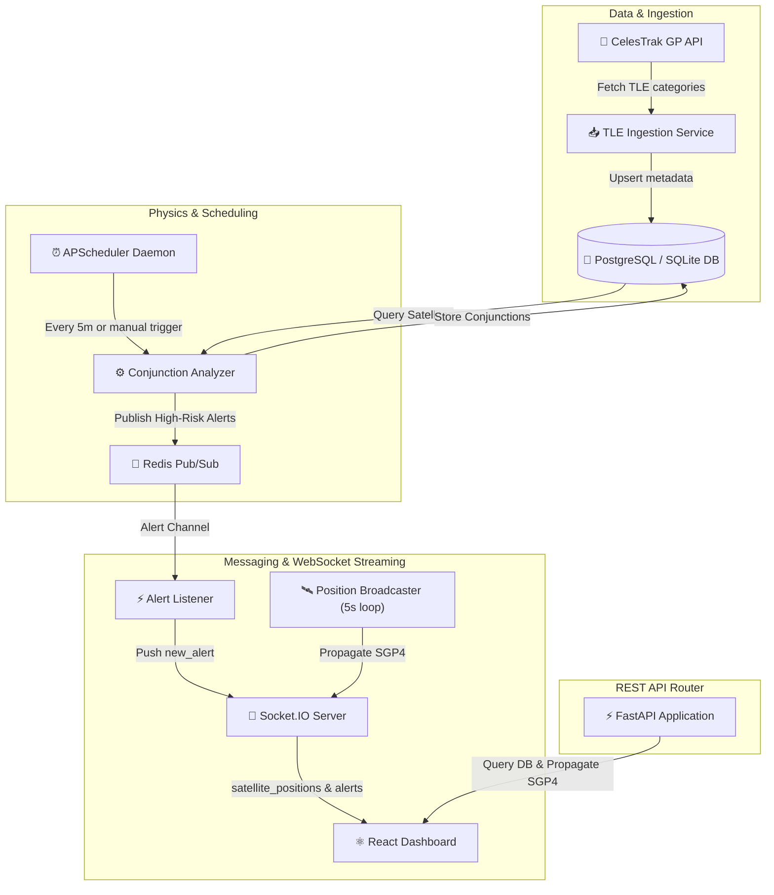

# 🛰️ OrbitalWatch Backend

FastAPI backend engine for satellite catalog ingestion, SGP4 orbital propagation, conjunction risk assessments, and real-time live position streaming via Socket.IO.

---

## 🏗️ System Architecture



### Key Subsystems
*   **TLE Ingestion & Fallback Engine ([app/services/tle_ingest.py](app/services/tle_ingest.py))**: Automatically pulls live orbital elements (TLEs) from CelesTrak. If CelesTrak is unreachable, it generates synthetically valid TLE arrays with high-variance orbital properties to ensure development environment reliability.
*   **Orbit Propagator ([app/services/propagation.py](app/services/propagation.py))**: Leverages `skyfield` and `sgp4` libraries to resolve coordinates (Latitude, Longitude, Altitude), velocities, and orbital period profiles at any target UTC time. Caches compiled `EarthSatellite` binary objects for a **500%–1000%** performance gain.
*   **Conjunction Analyzer ([app/services/conjunction.py](app/services/conjunction.py))**: Executes multi-phase spatial and temporal filtering (Geocentric shell filter $\rightarrow$ Coarse 10m step scan $\rightarrow$ 1m time refinement loop) to detect close-approach events within 1.0 km over a 72-hour forecast window.
*   **Real-time Streaming Hub ([app/websocket/stream.py](app/websocket/stream.py))**: Broadcasts propagated geodetic positions of up to 500 active objects every **5 seconds** over Socket.IO. Connects to Redis Pub/Sub to push instant high-risk conjunction alerts.

---

## 🛠️ Tech Stack & Dependencies

- **Web Framework**: [FastAPI 0.109+](https://fastapi.tiangolo.com/) + [Uvicorn](https://www.uvicorn.org/) (ASGI standard)
- **Database & ORM**: [SQLAlchemy 2.0 Async](https://www.sqlalchemy.org/) + [Alembic](https://alembic.sqlalchemy.org/) (Supports SQLite & PostgreSQL)
- **Orbit Calculation**: [Skyfield](https://rhodesmill.org/skyfield/) + [SGP4](https://pypi.org/project/sgp4/)
- **Real-Time Layer**: [python-socketio (v4)](https://python-socketio.readthedocs.io/)
- **Distributed Cache / PubSub**: [Redis](https://redis.io/)
- **Background Scheduling**: [APScheduler](https://apscheduler.readthedocs.io/)
- **Testing**: [pytest](https://docs.pytest.org/) + `pytest-asyncio` + `httpx`

---

## ⚙️ Setup & Local Development

### 1. Configure Environment Variables
Copy `.env.example` to `.env`:
```bash
cp .env.example .env
```
Default parameters use local **SQLite** (`orbitalwatch.db`) and fallback in-process event emission if Redis is unavailable.

### 2. Install Dependencies
Initialize your Python virtual environment and install packages:
* **Windows**: `python -m venv .venv` && `.venv\Scripts\activate`
* **macOS/Linux**: `python3 -m venv .venv` && `source .venv/bin/activate`

```bash
pip install -r requirements.txt
```

### 3. Run Database Migrations
Execute Alembic migrations to generate database tables:
```bash
alembic upgrade head
```

### 4. Automatic Database Ingestion
No manual database seeding is required. When you start the ASGI server for the first time, a background task automatically connects to CelesTrak and fetches TLE orbital data across the configured categories:
* **Active Payloads**: `weather`, `gps-ops`, `amateur`, `visual`, `stations`, `geo`
* **Debris Categories**: `iridium-33-debris`, `cosmos-2251-debris`, `fengyun-1c-debris`, `cosmos-1408-debris`

If the database is empty, the first conjunction scan will execute immediately after this ingestion completes.

### 5. Launch the ASGI Server
Start the Uvicorn application server:
```bash
python app.py
```
*The server runs on `http://localhost:8000`. Interactive OpenAPI documentation is available at `http://localhost:8000/docs`.*

---

## 🔌 API & Socket Event Reference

### 🌐 HTTP REST Endpoints

| Method | Route | Description | Query Parameters | Response Model |
| :--- | :--- | :--- | :--- | :--- |
| `GET` | `/ping` | Instant liveness check (no DB/Redis dependency) | None | `{ "status": "ok" }` |
| `GET` | `/health` | In-depth DB & Redis connectivity health status | None | `{ status, db, redis, timestamp }` |
| `GET` | `/api/stats` | Catalog metrics, conjunction counts & scan timestamp | None | Aggregated stats JSON |
| `GET` | `/api/satellites` | Retrieves paginated list of satellites | `limit` (default=500), `offset`, `object_type` | `List[SatelliteResponse]` |
| `GET` | `/api/satellites/search` | Search satellites by name or NORAD ID | `q` (min_length=1), `limit` (default=20) | `List[SatelliteResponse]` |
| `GET` | `/api/satellites/{norad_id}` | Details for a single satellite (adds country, launch date, orbital props) | None | `SatelliteResponse` |
| `GET` | `/api/propagate/{norad_id}` | Propagate satellite to a specific UTC datetime | `at` (ISO datetime string, optional) | `PositionResponse` |
| `GET` | `/api/conjunctions` | Retrieves list of computed proximity warnings | `risk_level`, `hours_ahead` (default=72), `limit` | `List[ConjunctionResponse]` |
| `GET` | `/api/conjunctions/{id}` | Retrieve single conjunction event details | None | `ConjunctionResponse` |
| `DELETE` | `/api/conjunctions/clear` | Purge conjunction records older than 24 hours | None | `{ "deleted": int }` |
| `POST` | `/api/refresh` | Trigger background conjunction rescan & position broadcast | None | `{ success, message, timestamp }` |

---

### 🔌 Socket.IO Events

#### Client to Server (Incoming)
*   `connect`: Initiates handshake. Server responds with `connected` event.
*   `subscribe_satellites`: Subscribes client to specific NORAD objects. Payload:
    ```json
    { "norad_ids": ["25544", "49044"] }
    ```
    *Server acknowledges with `subscription_updated` event.*

#### Server to Client (Outgoing)
*   `connected`: Emitted upon successful handshake:
    ```json
    { "status": "ok" }
    ```
*   `satellite_positions`: Broadcasts propagated satellite coordinates every **5 seconds**:
    ```json
    [
      {
        "norad_id": "25544",
        "name": "ISS (ZARYA)",
        "lat": -12.3456,
        "lon": 45.6789,
        "alt": 421.34,
        "latitude": -12.3456,
        "longitude": 45.6789,
        "altitude_km": 421.34,
        "velocity_kms": 7.66,
        "timestamp": "2026-07-20T11:20:00Z",
        "type": "payload",
        "object_type": "payload"
      }
    ]
    ```
*   `new_alert`: Broadcasts newly scanned high-risk conjunction events:
    ```json
    {
      "id": 14,
      "sat1_norad_id": "25544",
      "sat1_name": "ISS (ZARYA)",
      "sat1_type": "payload",
      "sat2_norad_id": "49044",
      "sat2_name": "ISS (NAUKA)",
      "sat2_type": "payload",
      "approach_time": "2026-07-21T05:22:10Z",
      "miss_distance_km": 0.027,
      "risk_level": "HIGH",
      "probability": 0.732,
      "relative_velocity": 1.85
    }
    ```

---

## 📋 Environment Variables

| Variable | Default | Description |
| :--- | :--- | :--- |
| `DATABASE_URL` | `sqlite+aiosqlite:///./orbitalwatch.db` | Async database connection string (SQLite / PostgreSQL) |
| `REDIS_URL` | `redis://localhost:6379/0` | Connection string for Redis / Valkey PubSub |
| `CORS_ORIGINS` | `["http://localhost:5173"]` | Authorized origin list for CORS |
| `TLE_UPDATE_INTERVAL_HOURS` | `24` | Refresh frequency for CelesTrak catalog elements |
| `HOST` | `0.0.0.0` | ASGI bind IP address |
| `PORT` | `8000` | ASGI server port |
| `RELOAD` | `false` | Enable Uvicorn hot reloading |

---

## 🧪 Testing & Verification

Run the test suite using `pytest`:
```bash
pytest
```

Run the end-to-end integration checklist (validates REST endpoints and real-time Socket.IO subscriptions):
```bash
python verify_backend.py
```
