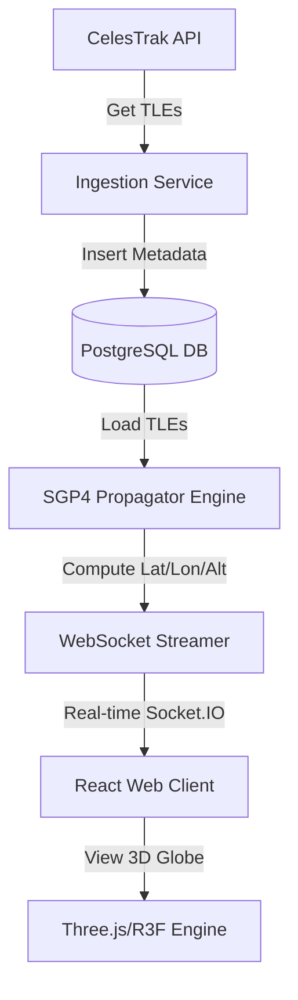

# Architectural System Plan — OrbitalWatch

This document presents the detailed architectural specifications, data flows, and technical implementation plan for the **OrbitalWatch** platform.

---

## 1. System Topology & Data Flow
The platform is split into three decoupled operational layers:
1.  **Ingestion/Physics Layer (Python)**: Fetches raw TLE strings, computes coordinates using SGP4, and updates the cache.
2.  **API/Routing Layer (FastAPI)**: Serves cached data, manages Socket.IO websocket streams, and computes proximity conjunctions.
3.  **Visualisation Layer (React + Three.js)**: Runs in-browser rendering on top of instanced coordinates received via WebSockets.



---

## 2. Database Schema
We use PostgreSQL (SQLAlchemy Async ORM) for local persistence of the satellite catalog.

### `SatelliteModel`
*   `id` (Integer, Primary Key)
*   `norad_id` (String, Unique, Index)
*   `name` (String)
*   `object_type` (String: payload, debris, rocket body, unknown)
*   `tle_line1` (String)
*   `tle_line2` (String)
*   `created_at` (DateTime)

### `ConjunctionModel`
*   `id` (Integer, Primary Key)
*   `sat1_norad_id` (String, Index)
*   `sat2_norad_id` (String, Index)
*   `approach_time` (DateTime)
*   `miss_distance_km` (Float)
*   `risk_level` (String: HIGH, MEDIUM, LOW)
*   `probability` (Float)
*   `relative_velocity` (Float)
*   `created_at` (DateTime)

---

## 3. High-Performance Optimizations

### Optimization A: Batch SQL Metadata Retrievals (N+1 Query Resolution)
Instead of executing sequential SQL select statements for each item during conjunction serialization, we fetch satellite names and types in a single database query using SQL `IN`:
```python
select(SatelliteModel.norad_id, SatelliteModel.name, SatelliteModel.object_type).where(
    SatelliteModel.norad_id.in_(list(norad_ids))
)
```
This reduces the database query complexity from $O(N)$ to $O(1)$.

### Optimization B: SGP4 Model Caching
Parsing raw TLE text lines is CPU-intensive. We cache instantiated `EarthSatellite` models in-memory:
```python
_satellite_cache: dict[str, tuple[str, str, EarthSatellite]] = {}
```
This increases propagation execution speeds inside real-time loops by over **5-10x**.
