# 🛰️ OrbitalWatch Frontend

OrbitalWatch is a modern, high-performance, real-time Space Situational Awareness (SSA) & Space Traffic Control dashboard. It tracks orbiting space objects, predicts proximity collision risks (conjunctions), simulates proposed launch trajectory insertion safety in Web Workers, and visualizes satellite mechanics on an interactive 3D WebGL Earth.

The frontend is built using **React 19**, **Vite 6**, **Three.js**, **React Three Fiber (R3F)**, **Tailwind CSS v4**, **Socket.IO Client (v4)**, and **Recharts**.

---

## 🏗️ Architecture & Component Flow

```mermaid
flowchart TB
    subgraph Core Shell
        Main[src/main.jsx] --> App[src/App.jsx]
        App --> Context[src/context/AppContext.jsx]
        Context --> Layout[src/components/Layout/MainLayout.jsx]
    end

    subgraph Navigation & Views
        Layout -->|Nav: globe| GV[Globe View]
        Layout -->|Nav: alerts| AV[Alerts View]
        Layout -->|Nav: simulator| SV[Launch Simulator View]
    end

    subgraph 3D Globe Elements
        GV --> TG[src/components/Globe/ThreeGlobe.jsx]
        GV --> ST[src/components/Globe/SatelliteTooltip.jsx]
        GV --> LS[src/components/Globe/LoadingSphere.jsx]
    end

    subgraph Dashboard Components
        GV --> SI[src/components/Dashboard/SatelliteInfo.jsx]
        GV --> SC[src/components/Dashboard/StatsCards.jsx]
        GV --> FB[src/components/Dashboard/FilterBar.jsx]
        GV --> SB[src/components/Dashboard/SearchBar.jsx]
        GV --> RB[src/components/Dashboard/RefreshButton.jsx]
        GV --> OC[src/components/Dashboard/OrbitalClock.jsx]
        GV --> AC[src/components/Dashboard/AltitudeChart.jsx]
        GV --> TD[src/components/Dashboard/TypeDistribution.jsx]
        AV --> AP[src/components/Dashboard/AlertPanel.jsx]
        AV --> AD[src/components/Dashboard/AlertDetail.jsx]
        SV --> LSP[src/components/Dashboard/LaunchSimulatorPanel.jsx]
    end

    subgraph Off-Thread Workers
        LSP -->|Post orbit params| Worker[src/workers/propagation.worker.js]
        Worker -->|Return 30-day clearance & Delta-V| LSP
    end

    subgraph Real-Time & API Integration
        Context --> useWS[src/hooks/useWebSocket.js]
        useWS --> WS[src/services/websocket.js]
        Context --> API[src/services/api.js]
    end
```



### Component Breakdown

*   **App Core Shell ([src/App.jsx](src/App.jsx))**: Orchestrates primary view navigation (Globe, Alerts, Launch Simulator), manages global modal overlays, keyboard shortcuts listener, and floating action controls.
*   **State Provider ([src/context/AppContext.jsx](src/context/AppContext.jsx))**: Central React Context store. Manages real-time satellite coordinate buffers, active selection profiles, filter criteria, search queries, launch simulator inputs, conjunction warning records, and camera tracking targets.
*   **3D WebGL Globe ([src/components/Globe/ThreeGlobe.jsx](src/components/Globe/ThreeGlobe.jsx))**: Powered by React Three Fiber. Features instanced mesh point clouds (`InstancedMesh`) for 500+ space objects, high-resolution Earth textures, custom atmospheric glow shaders, starfield skybox, historical orbit tracks, flashing conjunction proximity markers, and camera-following dynamics.
*   **Launch Trajectory Clearance Simulator ([src/components/Dashboard/LaunchSimulatorPanel.jsx](src/components/Dashboard/LaunchSimulatorPanel.jsx))**: Configures proposed launch site, insertion altitude, inclination, eccentricity, RAAN, payload mass, and deorbit strategies. Delegates SGP4 30-day forecast calculations to a background Web Worker.
*   **Off-Thread Web Worker ([src/workers/propagation.worker.js](src/workers/propagation.worker.js))**: Runs pure JavaScript SGP4 propagation off the main UI thread. Calculates Foster collision probability ($P_c$) using catalog TLE age variance and derives minimum Delta-$V$ Hohmann/plane-change orbital maneuver recommendations.
*   **Real-Time WebSocket Hook ([src/hooks/useWebSocket.js](src/hooks/useWebSocket.js))**: Listens to Socket.IO events, updating satellite positions every 5 seconds and appending incoming high-risk conjunction alerts with audio-visual notifications.
*   **Dashboard Panels & Widgets ([src/components/Dashboard/](src/components/Dashboard/))**:
    *   `SatelliteInfo`: Displays detailed NORAD catalog metadata, launch date, country of origin, altitude, velocity, orbital period, and raw TLE lines.
    *   `AlertPanel` & `AlertDetail`: Displays close-approach events, miss distance, collision probability, relative velocity, and camera focus triggers.
    *   `StatsCards`, `AltitudeChart` & `TypeDistribution`: Real-time catalog metrics and analytics rendered via Recharts.
    *   `SearchBar` & `FilterBar`: Full-text search and category filtering (Payload vs Debris, altitude ranges, risk levels).
    *   `RefreshButton` & `OrbitalClock`: Manual background rescan triggers and UTC orbital clock display.
    *   `DemoMode`: Guided interactive simulation tour.

---

## 🛠️ Tech Stack

*   **UI Framework**: React 19 (Functional Components + Hooks + Context API)
*   **Build Tool & Dev Server**: Vite 6 + ESBuild
*   **Styling**: Tailwind CSS v4 (native build pipeline integration)
*   **3D Graphics Engine**: Three.js + React Three Fiber (R3F) + `@react-three/drei`
*   **Off-Thread Physics Engine**: Dedicated Web Worker (`propagation.worker.js`)
*   **Real-Time Data Streaming**: Socket.IO Client (v4)
*   **HTTP Client**: Axios (configured with base URL and error interceptors)
*   **Data Visualization**: Recharts
*   **Iconography & UI**: Lucide React
*   **Testing Suite**: Vitest + React Testing Library + JSDom
*   **Code Quality**: ESLint

---

## ⚙️ Environment Variables

Vite manages environment configuration automatically. Variables must begin with the `VITE_` prefix:

| Variable | Description | Local Dev (`.env.development`) | Production (`.env.production`) |
| :--- | :--- | :--- | :--- |
| `VITE_API_URL` | Base REST API URL | `http://localhost:8000/api` | `https://<your-backend-domain>/api` |
| `VITE_WS_URL` | Base Socket.IO WebSocket target URL | `http://localhost:8000` | `https://<your-backend-domain>` |

> [!NOTE]
> In local development, `vite.config.js` configures proxy endpoints so requests to `/api` and `/socket.io` are automatically forwarded to the backend server running on `http://localhost:8000`.

---

## 🚀 Setup & Local Development

### Prerequisites
*   **Node.js**: v18.0.0 or higher
*   **npm**: v9.0.0 or higher

### 1. Install Dependencies
```bash
npm install
```

### 2. Start Development Server
```bash
npm run dev
```
Open your browser and navigate to `http://localhost:5173`.

### 3. Code Quality & Linting
Verify syntax correctness and code style:
```bash
npm run lint
```

### 4. Run Unit Tests
Execute unit tests via Vitest:
```bash
npm run test
```

---

## 📦 Build & Production Deployment

To compile static production assets:
```bash
npm run build
```
Optimized assets will be output to the `dist/` directory, ready to deploy to Vercel, Netlify, or AWS S3.

To preview the built production bundle locally:
```bash
npm run preview
```

---

## 🎹 Keyboard Shortcuts

Accelerate navigation across the dashboard using built-in keybindings:

| Key | Action |
| :---: | :--- |
| <kbd>/</kbd> | Focus search bar input |
| <kbd>g</kbd> | Switch view to 3D Earth Globe |
| <kbd>a</kbd> | Switch view to Conjunction Alerts table |
| <kbd>f</kbd> | Lock / unlock camera tracking on selected satellite |
| <kbd>d</kbd> | Toggle automated Demo Mode simulation tour |
| <kbd>?</kbd> | Open keyboard shortcuts modal reference |
| <kbd>Esc</kbd> | Close active panels, cards, or overlays |

---

## ⚡ Performance Optimizations

*   **InstancedMesh WebGL Rendering**: Renders 500+ satellite point cloud spheres inside a single Three.js draw call in `ThreeGlobe.jsx`, keeping framerates locked at **60 FPS**.
*   **Off-Thread Web Worker Computation**: Delegates heavy 30-day SGP4 launch clearance calculations to `propagation.worker.js`, preventing main-thread blocking or UI frame drops.
*   **5-Second Position Buffer Sync**: Smoothly interpolates satellite coordinates between 5-second Socket.IO telemetry telemetry pushes.
*   **React Context Selector Memoization**: Prevents unnecessary component re-renders when filtering or updating active selection targets.

---

## 🌐 Browser Support

This dashboard requires **WebGL hardware acceleration** to render the 3D globe and interactive Canvas elements. Supported browsers include:
*   **Google Chrome** & Chromium-based browsers (Edge, Brave, Opera)
*   **Mozilla Firefox**
*   **Apple Safari** (macOS & iOS)

> [!IMPORTANT]
> Ensure **WebGL hardware acceleration** is enabled in browser settings for optimal 60 FPS performance.
