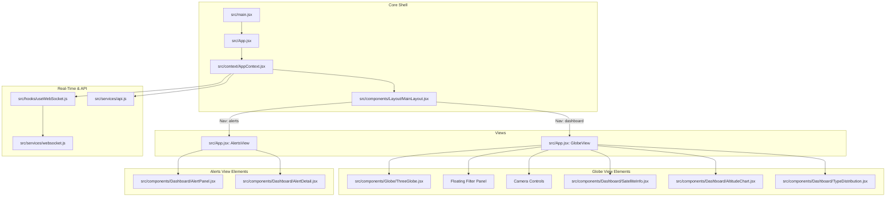

# 🛰️ OrbitalWatch Frontend

OrbitalWatch is a modern, high-performance, real-time Space Situational Awareness (SSA) dashboard that tracks orbiting objects, calculates collision risks (conjunctions), and visualizes satellites on an interactive 3D WebGL Earth.

The frontend is built using **React 19**, **Vite 6**, **Three.js**, **React Three Fiber (R3F)**, **Tailwind CSS v4**, and **Recharts**.

---

## 🏗️ Architecture & Component Flow



### Component Breakdown
*   **App Root ([src/App.jsx](src/App.jsx))**: Handles primary routing layout switches (Globe vs Alerts), wraps global overlays, and mounts controls.
*   **State Provider ([src/context/AppContext.jsx](src/context/AppContext.jsx))**: Serves as the central state hub. Exposes real-time satellite locations, conjunction alert histories, filters, coordinate caches, and the globally active selection profiles.
*   **3D WebGL Globe ([src/components/Globe/ThreeGlobe.jsx](src/components/Globe/ThreeGlobe.jsx))**: Implemented using React Three Fiber. Renders the textured Earth, atmosphere glow, active orbit trajectory lines, and high-performance point clouds for 500+ tracking elements. Includes hover tooltips, click selection, and camera-following modes.
*   **Real-time WebSocket Hook ([src/hooks/useWebSocket.js](src/hooks/useWebSocket.js))**: Manages the socket.io event lifecycle, updating coordinate buffers and appending incoming critical collision warnings. Includes an active heartbeat check (reconnects after 70s of silence).
*   **Dashboard Panels ([src/components/Dashboard](src/components/Dashboard/))**:
    *   `SatelliteInfo`: Details NORAD metadata, launch year, country of origin, altitude, velocity, and SGP4 TLE lines.
    *   `AlertPanel` & `AlertDetail`: Renders conjunction warnings (approach timing, miss distance, risk probability) and supports focusing coordinates on the 3D globe.
    *   `AltitudeChart` & `TypeDistribution`: Data visualizations built on `Recharts` for live altitudes (Area Chart) and catalog classification counts (Pie Chart).
    *   `DemoMode`: Automated simulation flow that guides the user through active satellites and conjunction events.

---

## 🛠️ Tech Stack

- **UI Framework**: React 19 (Functional Components + Context API)
- **Build System**: Vite 6 + ESBuild
- **Styling**: Tailwind CSS v4 (native build integration)
- **3D Graphics**: Three.js + React Three Fiber (R3F) + @react-three/drei
- **Real-Time Client**: Socket.IO Client (v4)
- **HTTP Client**: Axios (configured with interceptors)
- **Charts**: Recharts
- **Testing**: Vitest + React Testing Library + JSDom

---

## ⚙️ Environment Variables

The application uses Vite-specific environment configurations. Update variables in your `.env`, `.env.local` or `.env.production` files:

| Variable | Description | Local Default |
| :--- | :--- | :--- |
| `VITE_API_URL` | Base URL of the backend REST API | `http://localhost:8000/api` |
| `VITE_WS_URL` | Base URL of the backend WebSocket server | `http://localhost:8000` |

---

## 🚀 Setup & Local Development

### 1. Prerequisites
Ensure you have [Node.js](https://nodejs.org/) (v18.0.0 or higher) and [npm](https://www.npmjs.com/) installed.

### 2. Install Dependencies
```bash
npm install
```

### 3. Run Development Server
```bash
npm run dev
```
Once started, the dashboard is accessible at `http://localhost:5173`.

### 4. Code Quality & Formatting
Run the linter to verify syntax correctness:
```bash
npm run lint
```

### 5. Run Unit Tests
Validate component integrity and hooks via Vitest:
```bash
npm run test
```

---

## 📦 Build & Production Deployment

To compile the application into fully optimized static assets:
```bash
npm run build
```
The bundled files will write to the `dist/` directory, ready to be hosted on Netlify, Vercel, AWS S3, or GitHub Pages.

To run a preview of the production build locally:
```bash
npm run preview
```

---

## 🎹 Keyboard Shortcuts

Accelerate dashboard interaction with these built-in keyboard hotkeys:

| Key | Action |
| :---: | :--- |
| `/` | Focus search bar input |
| `g` | Switch view to 3D Globe |
| `a` | Switch view to Conjunction Alerts table |
| `f` | Lock/Follow camera target to selected satellite |
| `d` | Toggle automated Demo Mode |
| `Esc` | Close any open panels, cards, or overlays |
| `?` | Open keyboard shortcut references modal |

---

## 🌐 Browser Support

This dashboard relies on **WebGL** to render the interactive 3D globe and CSS Grid/Flexbox layouts. 
*   **Google Chrome** (and Chromium-based browsers like Microsoft Edge, Brave, Opera)
*   **Mozilla Firefox**
*   **Apple Safari** (macOS & iOS)

> [!IMPORTANT]
> Ensure **WebGL hardware acceleration** is enabled in your browser settings to prevent frame rate drops during 3D point cloud rendering.
